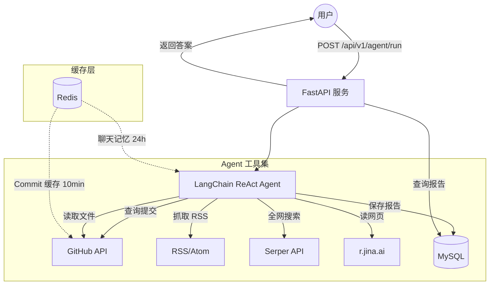

# DevRelay-Agent

面向开发者的 **GitHub + 技术博客** 追踪 Agent，基于异步 FastAPI、LangChain ReAct 与 Redis/MySQL。

## 功能概览

| 能力 | 说明 |
|------|------|
| ReAct Agent | 自动调用工具：commits、读文件、RSS、全网搜索、读网页、MySQL 归档 |
| GitHub | 最近 commit、读取 `README.md` 等仓库文件 |
| 技术博客 | RSS/Atom 订阅抓取（`fetch_rss_feed`） |
| Redis | 聊天记忆（24h）、GitHub commit 缓存（10min） |
| MySQL | 用户确认后保存技术报告 |
| Docker | 一键部署 MySQL + Redis + App |

## 架构图



## 快速开始

### 方式一：Docker 运行（推荐）

> 不需要手动安装 Python、MySQL、Redis，只需 [Docker Desktop](https://www.docker.com/products/docker-desktop/)。

```bash
# 1. 克隆项目
git clone https://github.com/jujuju-make/DevRelay-Agent.git
cd DevRelay-Agent

# 2. 配置环境变量
cp .env.example .env
# 编辑 .env，填入以下内容（至少填 OPENAI_API_KEY 和 GITHUB_TOKEN）：
#   OPENAI_API_KEY=sk-xxx
#   GITHUB_TOKEN=ghp_xxx
#   SERPER_API_KEY=xxx（可选，搜索功能需要）

# 3. 一键启动（MySQL + Redis + App）
docker compose up -d

# 4. 查看启动日志
docker compose logs -f app

# 5. 打开 Swagger 文档
open http://127.0.0.1:8000/docs
```

### 方式二：本地运行

```powershell
cd DevRelay-Agent
python -m venv .venv
.\.venv\Scripts\activate
pip install -r requirements.txt
copy .env.example .env
# 编辑 .env，填入 MySQL、Redis、OPENAI_API_KEY、GITHUB_TOKEN 等
python main.py
```

访问 Swagger：http://127.0.0.1:8000/docs

---

## 运行测试

测试代码位于 `tests/` 目录，使用 `pytest` 运行，无需外部依赖（所有网络请求都被 mock）：

```bash
# 安装测试依赖
pip install -r requirements.txt

# 运行全部测试
pytest tests/ -v

# 运行带覆盖率报告
pytest tests/ -v --cov=app --cov-report=term-missing

# 只运行某个测试文件
pytest tests/test_health.py -v

# 只运行某个测试类
pytest tests/test_github_tools.py::TestFormatCommitsSummary -v
```

**测试覆盖范围：**

| 测试文件 | 测试内容 |
|----------|----------|
| `test_health.py` | 健康检查 API 的正确性 |
| `test_github_tools.py` | GitHub 工具、搜索工具、缓存键生成 |
| `test_rss.py` | RSS/Atom 订阅解析、错误处理 |
| `test_agent_logic.py` | Agent 编排逻辑、消息提取、来源提取 |
| `test_cache.py` | Redis 缓存读写、异常处理 |
| `test_chat_memory.py` | 聊天记忆存储与加载 |
| `test_reports.py` | 报告 API、MySQL 归档工具 |

---

## API 示例

### 运行 Agent

```http
POST /api/v1/agent/run
Content-Type: application/json

{
  "query": "总结 fastapi/fastapi 最近更新，并读一下 README 要点",
  "session_id": "user-session-001",
  "repo_owner": "fastapi",
  "repo_name": "fastapi"
}
```

### 查询 RSS 博客（在 query 中提供 URL）

```json
{
  "query": "订阅 https://hnrss.org/frontpage 最近有哪些技术热点？",
  "session_id": "user-session-001"
}
```

### 列出已归档报告

```http
GET /api/v1/reports?limit=20&offset=0
```

### 报告详情

```http
GET /api/v1/reports/1
```

## 项目结构

```
app/
├── routers/      # health, agent, reports
├── services/     # agent_logic, chat_memory, cache
├── tools/        # github, rss, read_web_page
├── models/       # Report ORM
└── schemas/      # Pydantic 模型
scripts/
└── view_chat_history.py   # 终端查看 Redis 会话（中文）
```

## Redis Key 说明

| Key | TTL | 用途 |
|-----|-----|------|
| `devrelay:chat:{session_id}` | 24h | 多轮对话记忆 |
| `devrelay:commits:{owner}:{repo}:...` | 10min | GitHub commit 缓存 |

查看会话（本地运行）：

```powershell
.\.venv\Scripts\python.exe scripts\view_chat_history.py 你的session_id
```

查看会话（Docker 运行）：

```bash
docker exec -it devrelay-app python scripts/view_chat_history.py 你的session_id
```

## Docker 相关命令

```bash
# 启动所有服务
docker compose up -d

# 查看日志
docker compose logs -f app

# 停止所有服务
docker compose down

# 停止并删除数据卷（清空数据库）
docker compose down -v

# 重新构建镜像（修改代码后）
docker compose build app
docker compose up -d
```

## 工具列表（Agent）

- `fetch_repo_commits` — 仓库最近提交
- `read_github_file` — 读取仓库内文件（如 README.md）
- `fetch_rss_feed` — 技术博客 RSS/Atom
- `search_web` — 全网搜索（需 Serper API Key）
- `read_web_page` — 读取网页正文
- `save_to_mysql` — 归档报告（需用户明确同意）

## 许可证

MIT License — 个人学习 / 实习项目。
